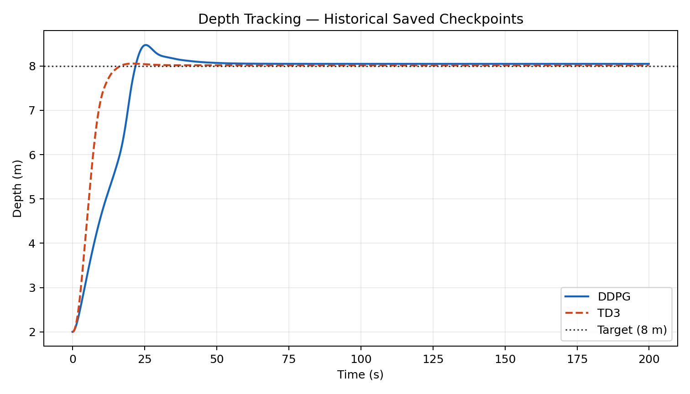
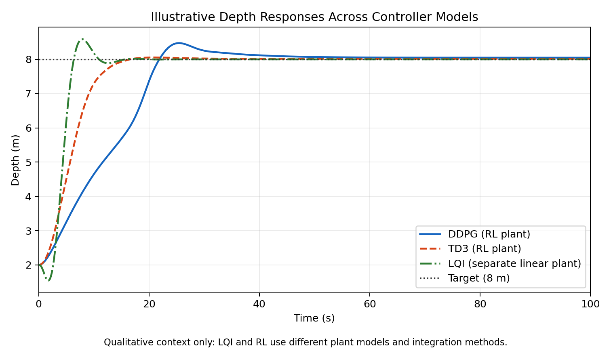

# Reinforcement Learning for AUV Depth Control

This project compares hand-written Deep Deterministic Policy Gradient (DDPG), Twin Delayed DDPG (TD3), and integral-augmented linear-quadratic regulation (LQI) for a constant-depth autonomous underwater vehicle (AUV) control problem. The emphasis is on a compact, inspectable implementation: the AUV simulation, replay buffer, neural networks, update rules, training loop, evaluation utilities, and LQI controller are implemented directly with NumPy, PyTorch, and SciPy.

The simulator is a simplified deterministic research model. It is useful for studying continuous-control algorithms, but it is not a high-fidelity vehicle model or evidence of readiness for physical deployment.



## Project overview

The regulation task starts the AUV at a specified depth and asks the controller to track a constant target depth. The RL policies observe a five-dimensional state and produce two continuous control inputs. Training uses off-policy actor-critic methods with replay buffers and target networks. A separate LQI example preserves the classical controller included in the original experiment.

No Gym or external RL framework is used. The public code can train and evaluate newly generated checkpoints without access to the private university-project source artifacts.

## Simplified AUV environment

`AUVConstantDepthEnv` models motion in the vertical plane at a fixed forward speed. Its state is

```text
[z - z_r, cos(theta), sin(theta), w, q]
```

where `z` is depth, `z_r` is target depth, `theta` is pitch, `w` is heave velocity, and `q` is pitch rate. Encoding pitch as sine and cosine avoids an angular discontinuity. The action is

```text
[tau_1, tau_2]
```

and each component is clipped to `[-100, 100]` before it is applied.

The dynamics use the project’s original reduced AUV equations and a `0.1 s` timestep. Integration is mixed/semi-implicit: heave velocity and pitch rate are updated first; depth then uses the updated heave velocity and the previous pitch, and pitch uses the updated pitch rate. It should therefore not be described as ordinary forward Euler applied simultaneously to every state.

The reward is the negative of a quadratic regulation cost evaluated after the transition. It penalizes depth error, pitch, heave velocity, pitch rate, and control use. The simulator is deterministic for a given state and action sequence.

The environment always returns `done=False`. Episodes in the training and evaluation utilities are fixed-horizon truncations of a continuing regulation task rather than natural terminal episodes, and replay transitions do not contain a terminal mask.

## DDPG

The DDPG implementation uses:

- a deterministic actor with two 128-unit ReLU hidden layers and a bounded `tanh` output;
- one critic with two 128-unit ReLU hidden layers;
- replay memory with a capacity of 100,000 transitions;
- target actor and critic networks updated by soft updates;
- discount factor `gamma = 0.99` and soft-update rate `tau = 0.005`; and
- additive Gaussian exploration noise during training.

Exploratory actions are clipped to the environment bounds before both application and replay storage, so replayed actions correspond to the transitions actually produced by the simulator.

## TD3

TD3 retains the same actor and critic layer sizes while adding the algorithm’s three central mechanisms:

- twin critics, using the smaller target estimate;
- clipped target-policy smoothing noise; and
- delayed actor and target-network updates.

Training also adds Gaussian noise to the selected action and clips the resulting action to the environment bounds. The implementation remains project-specific and does not wrap Stable-Baselines, RLlib, or another RL package.

## LQI / integral-augmented LQR

The LQI module augments a four-state linear plant with two integral-error states, solves the continuous-time algebraic Riccati equation, and simulates the resulting closed loop with SciPy’s continuous-time integration routine.

Importantly, LQI uses a different linear plant model from the simplified nonlinear RL environment. Its simulation is retained as a classical-control illustration, but its trajectory is not a strict same-plant performance benchmark against DDPG or TD3.

## Historical reference results

The curated results in [`results/reference_run/`](results/reference_run/) are deterministic evaluations of saved checkpoints from the original university project. They are not the result of freshly training the standalone code. The private checkpoint files are not included in this project and are not required to train or evaluate new models.

Both policies were evaluated for one 2,000-step rollout with a `0.1 s` timestep, starting at a depth of `2 m` and tracking a target depth of `8 m`. All reported values were calculated from the resulting trajectories.

| Metric | DDPG | TD3 |
|---|---:|---:|
| Cumulative reward | -4151.0283 | -2580.2588 |
| Final depth error (m) | 0.0491 | 0.0172 |
| Maximum depth overshoot (m) | 0.4751 | 0.0559 |
| Maximum absolute pitch (rad) | 0.4188 | 0.6501 |
| Squared-action effort | 684.7124 | 723.9487 |
| Total action variation | 31.0502 | 39.3280 |

In this single historical rollout, TD3 achieved the better cumulative reward, final depth error, and maximum depth overshoot. DDPG used less squared-action effort, had less total action variation, and reached a lower maximum absolute pitch. These measurements do not establish universal superiority for either algorithm.

Additional curated views:

- [Pitch](results/reference_run/pitch.png)
- [Heave velocity](results/reference_run/heave_velocity.png)
- [Pitch rate](results/reference_run/pitch_rate.png)
- [Control input τ1](results/reference_run/control_tau1.png)
- [Control input τ2](results/reference_run/control_tau2.png)
- [Machine-readable metrics](results/reference_run/metrics.json)

## Illustrative Comparison with LQI

The depth plot below places the historical DDPG and TD3 trajectories alongside the current LQI simulation to give qualitative context for their controller responses. LQI uses a separate linear plant and continuous-time integration, whereas DDPG and TD3 act on the simplified nonlinear RL environment with mixed/semi-implicit discrete updates. The curves therefore should not be treated as a same-plant benchmark or used for a quantitative performance ranking.



## Project structure

```text
auv-depth-control/
├── README.md
├── requirements.txt
├── src/auv_control/
│   ├── environment.py    # deterministic simplified AUV environment
│   ├── agents.py         # replay buffer, networks, DDPG, and TD3
│   ├── lqi.py            # separate linear LQI model and simulation
│   └── experiment.py     # training, evaluation, metrics, and plotting
├── scripts/
│   ├── train.py
│   └── evaluate.py
├── tests/
├── runs/                 # ignored generated training/evaluation artifacts
└── results/
    ├── reference_run/    # curated historical DDPG/TD3 checkpoint results
    └── lqi_comparison/   # qualitative comparison using a separate LQI plant
```

## Installation

The recorded working environment is Python 3.11.10 with the exact dependency versions in `requirements.txt`.

```bash
python3.11 -m venv .venv
source .venv/bin/activate
python -m pip install --upgrade pip
python -m pip install -r requirements.txt
```

The absence of dependencies in another local Python installation should not be interpreted as evidence that the project is incompatible with that Python version; Python 3.11.10 is simply the version tested here.

## Training

Run commands from the project root. The CLI defaults are 500 episodes, 200 steps per episode, seed 12, start depth `2`, and target depth `8`.

```bash
python scripts/train.py ddpg
python scripts/train.py td3
```

By default, generated artifacts go to `runs/ddpg_seed12/` or `runs/td3_seed12/`. Each run contains actor and critic checkpoints, an episode-reward NumPy array, and `run.json`, which records the effective configuration, hyperparameters, runtime versions, device, and artifact names. The `runs/` directory is ignored by Git.

Options can be inspected with:

```bash
python scripts/train.py --help
```

For example, a small diagnostic run with an explicit output location is:

```bash
python scripts/train.py ddpg \
  --episodes 2 \
  --steps-per-episode 100 \
  --seed 12 \
  --output-dir runs/ddpg_diagnostic
```

Training refuses to replace existing run artifacts. Pass `--overwrite` only when replacement is intentional. Add `--plot` to display the episode-reward history after training.

Seeding covers Python, NumPy, and PyTorch. The project does not enable stricter deterministic CUDA-kernel settings, so exact cross-device or cross-platform equivalence is not guaranteed.

## Evaluation

Evaluate an actor checkpoint produced by either agent with:

```bash
python scripts/evaluate.py runs/ddpg_seed12/ddpg_actor.pth \
  --label DDPG \
  --plot
```

To persist metrics, trajectories, and the depth plot:

```bash
python scripts/evaluate.py runs/ddpg_seed12/ddpg_actor.pth \
  --label DDPG \
  --output-dir runs/ddpg_seed12/evaluation
```

Persisted evaluation artifacts are `evaluation.json`, `trajectories.npz`, and `depth_tracking.png`. The compressed trajectory archive contains depth, pitch, heave velocity, pitch rate, actions, and rewards. Existing evaluation artifacts are protected from silent replacement; use `--overwrite` to replace them deliberately. Without `--output-dir`, evaluation continues to print metrics and optionally display a plot without saving files.

See all evaluation options with:

```bash
python scripts/evaluate.py --help
```

## Testing

The regression suite uses the Python standard library’s `unittest` runner:

```bash
python -m unittest discover -s tests -v
```

Tests cover environment transitions and reset behavior, action/replay consistency, actor shapes, finite update steps, training and evaluation length validation, output protection, manifests, persisted evaluation artifacts, and LQI simulation properties. They are deliberately small and do not require successful policy learning.

## Limitations

- The AUV model is simplified, deterministic, and restricted to vertical-plane depth regulation at fixed forward speed.
- The experiment does not model disturbances such as currents, sensor noise, actuator dynamics, saturation beyond direct clipping, or vehicle/environment uncertainty.
- Results from simulation do not demonstrate robustness or suitability for physical deployment.
- Episodes are fixed-horizon truncations of a continuing task; there are no terminal transitions or terminal masks in replay.
- The reward combines regulation and control penalties chosen for this experiment. Reported reward values are specific to this formulation and rollout length.
- The squared-action effort combines both action channels according to the project’s metric definition; it should be treated as a comparative simulation metric, not a calibrated physical energy measurement.
- The historical table reports one deterministic rollout per saved policy and should not be interpreted as a multi-seed statistical comparison.
- The LQI simulation uses a different linear plant and continuous integration, so direct numerical ranking against the RL rollouts would be misleading.
- Reproducing the exact historical reference table requires private checkpoints that are intentionally not distributed. The public project remains fully usable for new training and evaluation runs without them.

## Project origin

This work originated as a three-person university group project with approximately equal contributions. It was later cleaned up and restructured into this standalone portfolio project, with the original algorithms and experiment preserved while improving correctness, reproducibility, testing, documentation, and separation of private source artifacts from the public implementation.

## Primary references

- T. P. Lillicrap et al., “[Continuous Control with Deep Reinforcement Learning](https://arxiv.org/abs/1509.02971),” 2015.
- S. Fujimoto, H. van Hoof, and D. Meger, “[Addressing Function Approximation Error in Actor-Critic Methods](https://proceedings.mlr.press/v80/fujimoto18a.html),” *Proceedings of the 35th International Conference on Machine Learning*, 2018.
- T. I. Fossen, *[Handbook of Marine Craft Hydrodynamics and Motion Control](https://doi.org/10.1002/9781119575016)*, second edition, Wiley, 2021.
